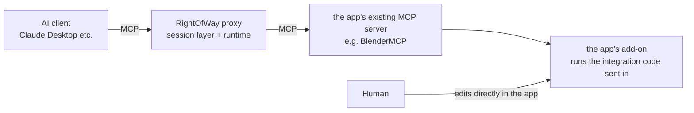
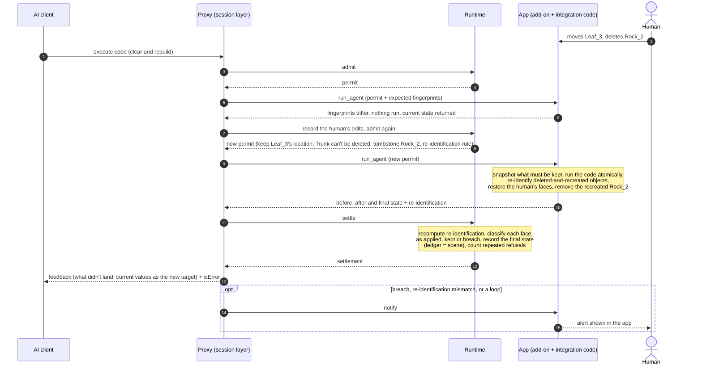

# RightOfWay

**Human edits always win — enforced by a runtime, not by prompting.**

RightOfWay is a protocol and reference runtime for humans and AI agents editing the same things at the same time: a Blender scene, a Unity scene, a document. The runtime sits between the agent and the application. When the agent's work collides with what a person just did, the person's edit is kept, the agent's conflicting change is rolled back, and the agent is told exactly what happened.

It needs no changes to the application. It works through what the application already offers: existing MCP servers (Blender MCP, Unity MCP) or plain files.

> **Status: research preview.** The rules, the runtime, and the Blender integration work and are tested. The MCP proxy that puts RightOfWay in front of Claude Desktop or any MCP client works too, and has been run against the real BlenderMCP server. The v0.4 Unity integration ran in Unity; the v0.5 changes to it haven't been verified in Unity yet. The agents in the experiments are still scripted, not real LLMs. The spec is currently written in Chinese; an English version is planned.
>
> 中文说明见 [README.zh-CN.md](README.zh-CN.md)。

## The problem

Agents that edit your files or your scene work from a snapshot they took a while ago. If you change something in the meantime, the agent's next step is still based on the old snapshot, and it quietly puts things back the way it remembers them. You move a leaf; the agent "tidies up" the tree and moves it back. You delete a rock; the agent notices a rock is missing and rebuilds it.

Current tools handle this by asking the model nicely (put the user's edits in the prompt and hope), by making you review every change, or by merging both sides symmetrically so the last writer wins. None of them *guarantees* that your edit survives. Answering a bug report about exactly this, Cursor's staff wrote that ["at the model level it's still a guideline, not a hard rule"](https://forum.cursor.com/t/158451).

## What RightOfWay does

- **Your edits win.** Anything you changed, the agent can't change. If its script touches it anyway, the runtime restores your version. Where an app can't undo a particular change, the runtime must say so, pause the agent and alert you instead of pretending (see [Known issues](#known-issues)).
- **Per property, not per object.** Conflicts are judged per *face* of an object: location, scale, material, mesh, modifiers… You move a leaf while the agent recolors all leaves for autumn: both changes stay. Faces are read automatically from the application's own data description (Blender RNA, Unity serialization); nothing is hand-defined per app. Data shared by several objects (a material, a mesh) is a unit of its own: recolour a shared material once and it is recorded once, on the material, and restored onto that same material.
- **What you're working on is off-limits.** Once you start editing an object it's occupied, and agent steps that depend on it wait. Optionally, simply selecting an object reserves it.
- **Stale writes don't land.** An agent's change based on an outdated view is voided instead of overwriting newer work.
- **Deleted and recreated is still the same object.** Agents often clear the scene and rebuild it. The runtime re-identifies each new object with the old one by name, type and parent (the app's duplicate-name suffix is learned by a self-test at connection time; ambiguous cases are not matched), so your edits survive and nothing is duplicated.
- **What you deleted stays deleted.** If the agent recreates an object you deleted before it saw the deletion, the runtime removes the recreation and tells the agent. The parents of objects you edited can't be deleted either.
- **The agent is told what it missed, with values.** Every time it reads or acts, it gets something like:
  ```
  Since you last looked at the scene:
  - Human deleted Rock_2
  - Human modified Leaf_3: Location (-0.647, 0.47, 1.4) → (-0.647, 0.47, 2.2)
  Partially applied: Leaf_3 (Material Slots applied; Location was changed by the human
  and kept — it is now (-0.647, 0.47, 2.2), your value (-0.647, 0.47, 1.6) was not applied)
  ```
- **What didn't land becomes the new target.** The feedback states the current values as facts to adopt into the agent's plan, and asks it to recheck anything it derived from the old values. If the agent keeps trying to change something it can't, you get an alert.
- **Several agents at once.** The human outranks every agent. Between agents, the first to commit wins; the later one's conflicting part is voided, it is told the current values, and it gets a short reservation to retry so two agents don't keep undoing each other.
- **In front of your AI client.** The MCP proxy: Claude Desktop (or any MCP client) connects to RightOfWay, and RightOfWay connects to the app's existing MCP server (e.g. BlenderMCP). Code-execution tools, the app's own typed tools and the proxy's small tools all go through the same rules; results that were partly refused come back with `isError` and a structured explanation.
- **Computer-use agents too.** An agent that clicks around needs its own screen, so it works on its own copy in its own app window. The runtime keeps the two copies in sync live through the apps' existing MCP servers: no saving, no reopening files. Apps with no interface at all fall back to merging saved files.

## Principles

In priority order: when two conflict, the earlier one wins.

1. **Truthful.** What's in the app, what the runtime has recorded, and what you and the agent are told must always agree. A guarantee that can't be kept is reported as such, never as success.
2. **Enforced by the runtime, not by prompting.** Safety never depends on the agent cooperating; prompts only make it more efficient.
3. **No changes to the application.** Only what the app already offers: MCP servers, scripting APIs, files. Markers left in your files (object ids) must be invisible, harmless, and removable.
4. **Nothing hand-defined per app.** Objects, properties, conflicts, and what an integration can guarantee are read from the app's own data model or measured by the same tests for every app.
5. **Human edits win**, within the limits above. Where that can't be done, principle 1 takes over: the breach is reported, you are alerted, and the agent is paused.
6. You don't do anything extra: no locking, no approving every change.
7. Per property, not per object.
8. The agent is told what happened, with values.

Behind all of them: the rules are decided in one place, the runtime. The full list, with what each principle rules out, is section 0 of the [spec](spec/spec_v0.4.md).

## How it works



RightOfWay's code runs in two places:

- **In the proxy process.** The AI client connects only here. The session layer (`rightofway/proxy`, `blender/shared_session.py`) routes each tool call into the pipeline below and writes the feedback for the agent. The runtime (`runtime.py`) holds the ledger and the rules, and is the only place that decides.
- **Inside the app.** The integration code (`blender/blender_side.py` plus `identity.py`) carries out the permit and reports the actual state. It isn't installed: it is sent in with every call through the app's existing code-execution tool, so neither the app nor its add-on changes.

Here is one code-execution call, using the story from the experiments: the human moves Leaf_3 and deletes Rock_2, then the agent clears and rebuilds the scene without looking first.



- **How your edits reach the ledger (steps 5–8).** The proxy doesn't poll in the background. Every execution carries the fingerprints the runtime expects; if they don't match, nothing runs and the current state comes back (optimistic concurrency). The session layer records the difference as your edits and asks for a new permit, up to 3 retries. Reading the scene (read-only tools, `rightofway_observe`) also picks up your edits.
- **The permit (step 8)** lists the faces to keep (edited by you, or recently changed by or reserved for another agent), the ancestors that can't be deleted, tombstones (objects you deleted that this agent hasn't seen deleted yet), and the re-identification rule.
- **Execution (steps 9–10)** runs in one go on the app's main thread, so you can't interleave with it and every change in between is the agent's.
- **Settlement (steps 11–12)** looks only at the actual state, never at what the permit hoped for. A face that had to be kept and is unchanged is kept; one that changed is a breach, recorded as it happened, and you are alerted and the agent is paused. Every other face is committed from the final state. The ledger's unit is a face: each property of each object, plus each property of the materials, meshes and other data blocks it uses. The integration pairs re-identified objects; the runtime recomputes the pairing with the same rule from `identity.py` and checks it.
- **Feedback (steps 13–15)** is generated only from the settlement: text for the model in `content`, the structured result in `_meta.rightofway`, and `isError=true` whenever part of the call didn't land.

Besides code execution, the proxy handles two other kinds of call:

- **The app MCP server's other tools.** The proxy can't know which faces such a tool changes, so object names appearing in its arguments are taken as its targets. The call is prechecked per object and refused up front if a whole object has to be kept or the app couldn't undo the call afterwards; otherwise it runs between the integration's `begin_agent` and `finish_agent` and is settled the same way. This path isn't atomic.
- **The proxy's own small tools** (`rightofway_set_property`, `rightofway_create_object`, `rightofway_delete_object`) are checked per face before they run, with forbidden faces dropped, then compiled into a script and sent through the same `run_agent`. `rightofway_observe` tells the agent what it missed and what it can't change right now.

What an integration can do (restore a face, restore a deletion, wrap a tool call, how duplicates are renamed) isn't hand-declared: at connection time it is tried in a throwaway scene with the same code used for real calls. The runtime uses the result to decide whether to re-identify and which calls to refuse up front.

| | Mode 1: shared copy | Mode 2: separate windows, live sync | File fallback |
|---|---|---|---|
| Agent works through | scripts / MCP tools | computer use (mouse and keyboard) | computer use; app has no interface |
| Rules applied | on every agent action | on every sync (after each agent step) | on every save |
| What the human has to do | nothing | nothing | save, then reopen the file |
| Uses the pipeline above | yes | not yet: per-unit submit, per object | not yet: per-unit submit, per object |

Design details are in [spec/design_v0.5.md](spec/design_v0.5.md), and a plain-language walkthrough of the protocol in [docs/overview.md](docs/overview.md) (both in Chinese).

## Results so far

Same task in experiments A–D: the agent builds a small scene (tree, leaves, rocks); the human deletes a rock, moves a leaf, adds a cube; the agent then adjusts the whole scene based on what it saw earlier (autumn colours, uniform leaf height, rocks in a circle). Agents are scripts and the human is simulated. Headless Blender (bpy 4.5), all numbers from `python -m experiments.run_all`. Every protected run is also checked after each step for three invariants: the scene matches the runtime's record, what had to be kept was kept, and what the agent is told is true. Experiment E checks what happens when the agent deletes an object you edited, including an integration that can't undo the deletion (see Known issues).

| Experiment | Setup | Human edits overwritten | Agent edits lost | Deleted object rebuilt |
|---|---|---|---|---|
| A: shared copy | with RightOfWay | 0 | 0 | 0 |
| A: shared copy | no protection (plain Blender MCP) | 2 | 0 | 1 |
| D: two agents + human | with RightOfWay | 0 | 0 | 0 |
| D: two agents + human | no protection | 1 | 1 | 1 |
| B: live sync | with RightOfWay | 0 | 0 | 0 |
| B: live sync | last sync wins | 1 | 0 | 0 |
| B: file fallback | with RightOfWay | 0 | 0 | 0 |
| B: file fallback | whoever saves last wins | 3 / 0 | 0 / 11 | — |
| E: agent deletes an object you edited | with RightOfWay, Blender (per property) | 0 | 0 | 0 |
| E: agent deletes an object you edited | with RightOfWay, simulated Unity integration (can't restore deletions) | 1, reported as a breach | 0 | 0 |
| P: through the MCP proxy | with RightOfWay, simulated app MCP server | 0 | 0 | 0 (recreation blocked) |

**Invariants:** every protected run of A, B, D, E and P passes all three. In E with the simulated Unity integration the leaf is lost, because that integration can't undo a deletion; the runtime records it as a breach, tells the agent and you, and pauses the agent. The file fallback is not covered by the invariant checks yet.

The v0.4 Unity integration was checked in a real Unity 6.4 editor through Unity's own MCP: the human's leaf height survived, the agent's autumn colour applied, a selected object was left alone, and nothing outside the experiment scene changed (57 tracked objects, about 0.07 s per agent step). The Unity integration code changed in v0.5 (executing the runtime's permit, the connection self-test) hasn't been run in Unity yet; only its C# syntax is checked.

### Realistic agent habits (experiment H)

The agents in A–E edit precisely. Real agents mostly don't: they run one large script that sets everything (BlenderMCP, Blender Lab's MCP server), regenerate the whole scene program every round (SceneCraft, LL3M), or send batches of up to 25 typed commands (Unity MCP's `batch_execute`). Experiment H reruns A, D and E with those habits. It also makes one human edit at a time (every object × move, rotate, scale, delete, plus recolouring a shared material) just before the agent's step, and counts how often the step collides with it.

| Agent habit | Your one edit collides with the agent's step (Blender) | What happens to your edit |
|---|---|---|
| Precise edits | 31% | kept |
| Adjust everything | 83% | kept |
| Clear and rebuild | 100% | kept, no duplicates: deleted-and-recreated objects are re-identified (on by default). With that turned off it is a breach every time: your restored object sits next to the agent's new copy (`Leaf_3.001`) and the agent is paused |
| Typed batches (simulated Unity) | 71% | kept: conflicting commands are refused before they run, so even an app that can't undo a deletion never loses one |

When you delete an object and the agent's step would put it back (3 of 11 deletions for precise and adjust-everything scripts, 11 of 11 for clear-and-rebuild), the recreation is now blocked. The invariants held in every run (42 scenario runs, 353 single-edit runs). Two conclusions. Collisions are the normal case, so rejecting an agent's whole step whenever it touches your work would stall the agent while you're working; the runtime applies the rest of the step and tells the agent exactly what it couldn't change and what the value is now. And clear-and-rebuild needs the runtime to recognise a deleted-and-recreated object as the same object. Details are in [design §12–13](spec/design_v0.5.md).

### Known issues

- **Unity can't restore an object the agent deleted yet.** This is reported truthfully: the runtime records the deletion as it actually happened, marks it as a breach, alerts you, and pauses the agent until you resume it. A hidden-backup restore for Unity is the next step. The Unity side also lacks re-identification, wrapping of typed tool calls and in-app alerts; those work in Blender and the simulated apps. Unity's connection self-test is written to report that it lacks them, but like the rest of the v0.5 Unity changes it hasn't been run in Unity yet.
- **The MCP proxy's handling of the app's own typed tools is not atomic.** It checks before and after the call, so anything you change in the app in between is attributed to the agent. Code-execution tools and the proxy's own small tools (`rightofway_set_property` etc.) are atomic.
- **Derived changes and intent conflicts are reported, not fixed.** If a leaf is restored to the height you set, a bird the agent placed above it may float in mid-air: the agent is told to treat the leaf's current height as the target and recheck, but the runtime doesn't move the bird.

Fixed on 2026-10-09: clear-and-rebuild breaking object identity (re-identification, on by default); agents rebuilding objects you deleted (blocked); deleting the parent of an object you edited (ancestors can't be deleted); a shared material split into a private copy per object (shared data blocks are units of their own). Fixed in v0.5 step 3: deleting an object you touched is judged for the whole object, so the agent is no longer told the deletion partly took effect.

**Not verified yet:** the v0.5 Unity integration code (experiments C and E need rerunning in Unity), real LLM agents, a real computer-use agent, live sync between two Blender GUIs, edit mode and Ctrl+Z in the Blender GUI, and large scenes.

## Quick start

Requires Python 3.10+. The Blender tests and the cloud-style experiments need Python 3.11 with `pip install bpy`; everything else skips cleanly without it.

```bash
git clone https://github.com/IndexCH/RightOfWay.git
cd RightOfWay
python -m venv .venv
.venv/bin/pip install -e ".[dev,proxy]"    # Windows: .venv\Scripts\pip install -e ".[dev,proxy]"
.venv/bin/python -m pytest                  # 211 tests; the bpy and mcp ones skip when those aren't installed
python examples/demo_game_assets.py         # narrated walkthrough of the runtime, no Blender needed
```

Run every experiment and get a summary table:

```bash
python -m experiments.run_all               # simulated human
python -m experiments.run_all --human real  # you do the human steps in Blender / Unity
```

### Using it from Claude Desktop (MCP proxy)

After installing `.[proxy]`, replace the blender server in Claude Desktop's `claude_desktop_config.json` with:

```json
{"mcpServers": {"blender": {"command": "C:/path/to/RightOfWay/.venv/Scripts/python.exe",
                            "args": ["-m", "rightofway.proxy", "--", "uvx", "blender-mcp"]}}}
```

Everything after `--` is the command that used to start the Blender MCP server, unchanged; Blender itself still just needs the BlenderMCP add-on with its server started. The proxy logs to stderr, and alerts such as breaches also pop up inside Blender. Add `--bridge socket` to talk to the add-on directly instead of through the upstream code tool. To see it work without Claude: `python -m experiments.exp_p_proxy` (simulated upstream) or `--upstream "uvx blender-mcp"` (a running Blender).

Each experiment needs its application ready (Blender with the [Blender MCP add-on](https://github.com/ahujasid/blender-mcp) server started; a second Blender on port 9877 for live sync; Unity 6 with the AI Assistant package for Unity). Groups that aren't ready are skipped with the reason. Step-by-step instructions (in Chinese) are in [docs/experiments.md](docs/experiments.md).

## Repository layout

```
rightofway/              runtime (Python package)
├── runtime.py           protocol rules R1–R21 and R23; issues the permit for every agent action, then verifies and records
├── identity.py          re-identification rules (the same code runs in the runtime and in the integrations)
├── invariants.py        checks that the scene, the runtime's record and the agent's feedback agree
├── fakeapp.py           an in-memory app speaking the same protocol (code or typed commands), for tests without Blender or Unity
├── proxy/               MCP proxy: python -m rightofway.proxy -- <command that starts the app's MCP server>
├── blender/             Blender integration: no changes to Blender or its MCP add-on
│   ├── blender_side.py  integration code sent into Blender with each call: carries out the permit, re-identifies, restores, reports the actual state; also sync and merge
│   ├── shared_session.py  session layer (mode 1): runs each call through the pipeline; per-agent views, "what you missed" (R22), multiple agents (R23)
│   ├── commands.py      typed commands compiled into Blender scripts (for the proxy's small tools)
│   ├── live_sync.py     mode 2: separate windows, live sync
│   ├── filemerge.py     file fallback: per-object three-way merge
│   └── local_server.py  a bpy process that speaks the Blender MCP add-on protocol (for headless tests)
└── unity/               Unity integration through Unity's own MCP (Unity_RunCommand)
experiments/             experiments A, B, C (Unity), D (two agents), E (agent deletes an object you edited),
                         H (realistic agent habits), P (through the MCP proxy), S (shadow execution trial) and run_all.py
tests/                   211 tests, including the invariant checks
spec/spec_v0.4.md        protocol spec (Chinese, draft); section 0 lists the design principles
spec/design_v0.5.md      v0.5 architecture redesign (Chinese; steps 1–3 implemented; section 13: hardening from the survey)
spec/related_work.md     how this relates to existing papers, protocols and tools
spec/prior_art_solutions.md  how other systems handle the same four problems (Chinese, 2026-10-08)
docs/overview.md         plain-language walkthrough of the protocol (Chinese)
```

## How it relates to other work

Nothing we found combines runtime-enforced human priority, occupancy triggered by the human's own edits, per-property granularity read from the app, and zero changes to the app. The pieces exist separately:

- Stale-write rejection between agents: STORM, S-Bus.
- Prompt-level "don't overwrite the user": CLEO; the system reminders in coding agents.
- Isolated desktops for computer-use agents, with file-level merge back: UFO², TClone, Windows Agent Workspace.
- Property-level last-writer-wins between humans: Figma multiplayer.

Details and sources are in [spec/related_work.md](spec/related_work.md).

## Roadmap

0. **v0.5 architecture** ([design](spec/design_v0.5.md)): every operation goes through one pipeline (permit → execute → verify → commit → report), with invariant checks that the scene, the record and the feedback agree. Steps 1–3 are done, and so is the hardening suggested by the survey of similar systems (re-identification, blocking recreations, protected ancestors, shared data blocks, feedback with the new targets, loop detection, capability probing; section 13). Next is the Unity side: rerun experiments C and E in Unity to verify the v0.5 changes, then hidden-backup restore and re-identification.
1. **MCP proxy**: done (`python -m rightofway.proxy`). Next: real LLM agents through Claude Desktop, compared against prompt-only protection.
2. Shadow execution (trialled: same outcomes, 4–5× slower per step) is kept for apps that can't undo changes.
3. A real computer-use agent on its own desktop, connected to live sync.
4. A user study: do people intervene more, and does per-property protection match what they meant?
5. English spec; more applications through their existing MCP servers.

## Contributing

This is early. Issues describing where an agent overwrote your work (which tool, which app, what happened) are especially useful, as are questions about the rules in the spec. Integrations for other applications that already have an MCP server are welcome; open an issue first so we can agree on the approach.

## License

The code is licensed under the [Apache License 2.0](LICENSE). The specification and other documents under `spec/` and `docs/` are licensed under [CC BY 4.0](https://creativecommons.org/licenses/by/4.0/).

## Author

Yuan ([@IndexCH](https://github.com/IndexCH))
