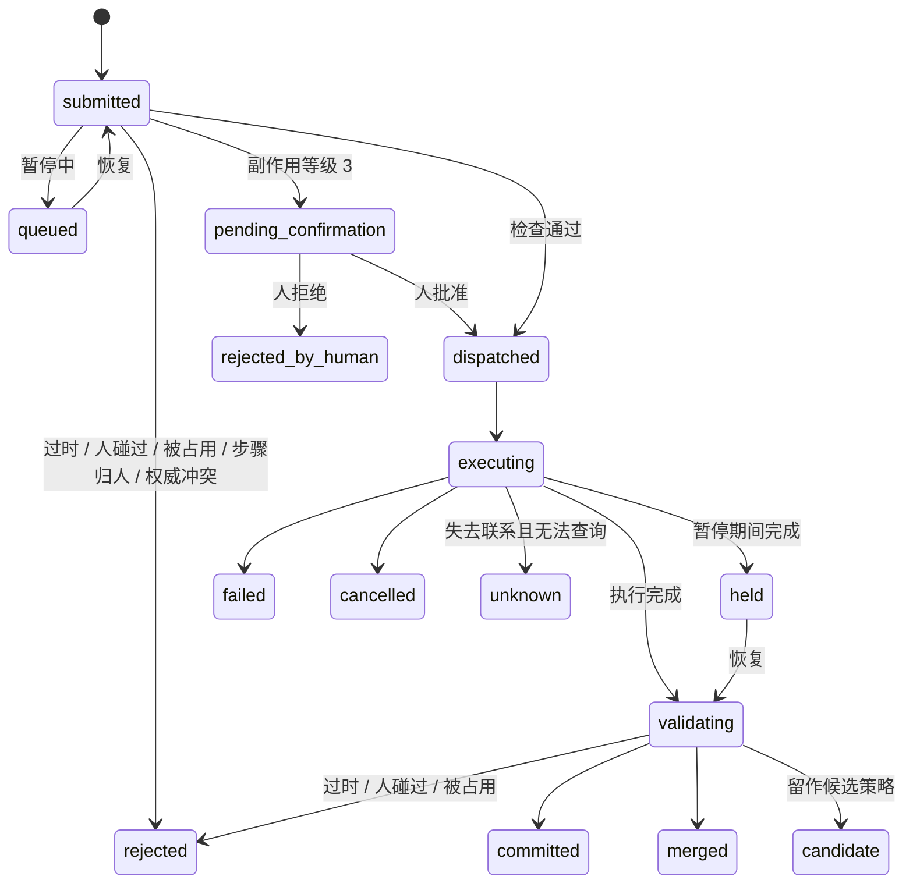
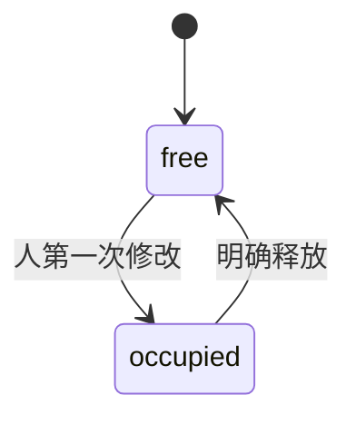
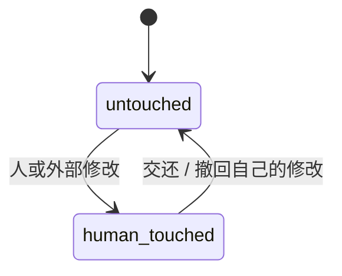
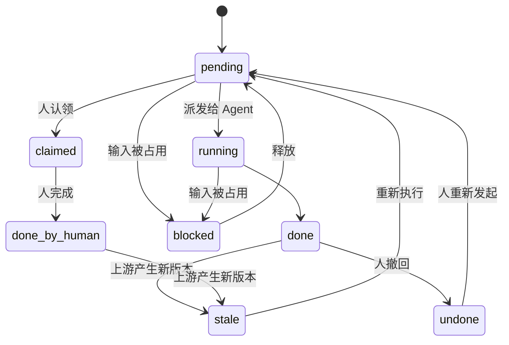

# 人机同时协作协议 v0.3（草案）

| 项 | 内容 |
|---|---|
| 名称 | 暂名 Cowork Protocol |
| 版本 | 0.3-draft |
| 状态 | 草案，已有参考实现（`cowork/`）、Blender 接入（`cowork/blender/`）和 Unity 接入（`cowork/unity/`），86 个自动测试全部通过 |
| 作者 | Yuan |
| 日期 | 2026-09-27 |
| 配套文件 | `scenarios/scenarios_v0.md`（一致性测试场景） |

**v0.3 相对 v0.2 的变化**（范围调整，以及接入 Blender 时发现的问题）：

1. **不要求应用做任何适配**。协议只约束 Agent；运行时用应用已有的东西（文件、现成的 MCP 服务器）发现人的修改。原第 9 节"适配器支持等级"改为"观察与协作方式"。
2. 新增两种协作方式：**同一份**（Agent 通过接口操作，实时）和**各自一份**（Agent 用 computer use 操作，存盘后按对象合并），见第 9 节。
3. 新增"写集事后确定的操作"：Agent 执行一段脚本或用 computer use 时，事先不知道会改哪些对象。改为执行前保护、执行后按对象确定写集（R3、R4、9.3）。
4. 存盘时才发现的人的修改：标记人碰过，但不建立占用（R8）。
5. 方式二中，运行时推断每份文件的基准版本，旧文件里没改过的部分不覆盖新内容（R21、9.4）。
6. 方式一中，读集检查放宽为"告诉 Agent 它读取之后人做了什么"（9.3）。
7. **"人碰过"按面记录**（在真实 Blender 里试出来的）：一个对象可以分成几个互相独立的面，例如 Blender 对象的位置、材质、网格、修改器。面从应用自己的数据描述里自动得到，不按应用手工定义（9.2）；已经在 Blender（RNA）和 Unity（序列化）上实现。人挪了叶子、Agent 把叶子改成秋色，两边都生效；只有 Agent 改到人改过的那个面才不生效（R6、9.2）。按整个对象记录时，这类修改会被当成冲突，属于"假冲突"。
8. Agent 改到了追踪范围以外的对象（例如共用的材质影响到别的场景）时，运行时必须报告（R18、9.3）。

**v0.2 相对 v0.1 的变化**（都是在写参考实现时发现的）：

1. R6 增加三种策略（丢弃 / 留作候选 / 合并），解决和 S-A2 的冲突。
2. "可合并"改为对象的属性（5.2），不再放在能力元数据里（5.4）。
3. 操作同时携带读集和写集的基准版本（5.5、R4）。
4. 批量步骤按成员拆成多个操作（R6）。
5. 撤回产生的版本继承被恢复版本的"人碰过"状态（R14）。
6. 新增状态 `queued`、`candidate`、`rejected_step_assignment`、`rejected_authority`；新增消息 `conflict/external_overwrite`、`result/candidate`、`step/reopen`。
7. 外部修改不产生占用（R8）；占用期间不向对象提交任何 AI 写入，包括合并（R9）。

规范中的 MUST、MUST NOT、SHOULD、SHOULD NOT、MAY 按 RFC 2119 的含义理解。本草案用中文撰写，字段名和规范关键词用英文，对外发布前整体译成英文。

---

## 1 摘要

AI Agent 越来越多地直接操作应用和文件，人也会在 Agent 运行时插手修改同一批对象。现有系统在这种情况下都处理得不好：Agent 会把人的修改改回去；轮流接管时，Agent 看不见人做了什么；基于旧观察的写入会悄悄覆盖人的修改。

本协议规定人和 Agent 同时修改同一批对象时，各方必须遵守的规则：

- 每次修改都带上基准版本，基准版本过时的 Agent 写入整体作废。
- 人的修改总是生效。人碰过的对象，Agent 不再修改。
- 人一开始修改某个对象，就占用它，并阻塞依赖它的后续步骤，直到人明确释放。

所有修改都经过一个运行时。协议只约束 Agent，不要求应用为它做任何修改：运行时用应用已有的东西（文件、现成的 MCP 服务器）发现人的修改。

- Agent 通过接口操作时，人和 Agent 改同一份，实时生效。
- Agent 用 computer use 操作时，双方各改一份，存盘后按对象合并。

运行时通过 AG-UI 连接界面。协议不规定 Agent 怎么规划，也不规定界面长什么样。

## 2 动机

| 系统 | 观察到的问题 |
|---|---|
| CLEO（研究一） | Agent 不区分哪些修改是人做的，会把人的修改改回去，用户因此不敢再插手 |
| Magentic-UI | 人接管期间 Agent 看不到人做了什么，只能靠人口头描述 |
| Collaborative Gym（开源代码） | 编辑是整份替换，基于旧观察的写入会覆盖人的修改 |
| Cocoa | 改了一步，其后的所有步骤全部重跑；重新规划时丢掉旧步骤 |
| WeaveBench | Agent 用旧副本覆盖了正确的文件，作者将原因归结为缺少同步机制 |

现有协议也没有覆盖这一层：

- **AG-UI**：状态同步没有版本和冲突处理，文档把冲突处理留给了实现者；中断只能由 Agent 发起。
- **MCP**：有扩展机制和长任务扩展（Tasks），但没有对象版本和占用的概念。

本协议补上的就是这一层。

2026 年 9 月的相关工作调研见 `related_work.md`：没有找到完全重合的工作；旧写入作废（④）在 AI 之间已有较多做法，但人优先的强制执行、人触发的占用、不改应用、按面自动读取、computer use 的按对象合并都没有先例。

## 3 范围

**协议规定：**
- 对象、版本、操作者、操作的数据格式
- 各方之间传递的消息
- 运行时必须执行的规则
- 操作、对象占用、步骤三者的状态机
- 运行时如何发现人的修改，以及两种协作方式下规则在什么时候执行
- 与 MCP、AG-UI 的对应方式

**协议不规定：**
- Agent 如何规划，以及如何做意图重审
- 组合（工作流）的完整格式；本协议只用到其中对"步骤"的引用
- 偏好学习、脚本固化
- 界面外观
- 应用需要做的任何修改：本协议不要求应用适配

## 4 术语

- **运行时（Runtime）**：执行本协议规则的唯一一方。所有修改都经过它。
- **操作者（Actor）**：发起修改的一方，分三类：
  - `human`：人。
  - `agent`：AI。
  - `external`：无法确认来源的外部修改，例如只能靠文件监视发现的修改。
- **对象（Object）**：被修改的东西，例如一个文件、应用里打开的一份文档、一帧图片。每个对象有唯一的 `objectId`。组合本身也是对象。
- **版本（Version）**：对象每提交一次就产生一个新版本，版本号在同一对象内单调递增。
- **权威副本（Authority）**：同一个对象可能同时有多个副本，例如磁盘上的文件和应用里打开的文档。任一时刻只有一个副本是权威。
- **操作（Operation）**：一次修改请求，写明目标对象及各自的基准版本。
- **基准版本（Base version）**：操作者发起操作时所依据的对象版本。
- **人碰过（Human-touched）**：对象的最新版本是由 `human` 或 `external` 产生的。
- **占用（Occupancy）**：人正在修改某个对象的状态。
- **释放（Release）**：人明确结束占用。
- **交还（Hand back）**：人明确允许 Agent 再次修改某个"人碰过"的对象。
- **步骤（Step）**：工作流中的一个节点，读取一些对象，产出一些对象。
- **观察来源**：运行时发现人的修改所用的手段，例如解析存盘的文件、通过现成接口定时列出对象。见第 9 节。
- **指纹**：由对象内容算出的短字符串，内容不变指纹就不变。用来判断对象有没有被改。
- **协作方式**：同一份（Agent 和人改同一个打开着的应用）或各自一份（各改一份文件，存盘后合并）。见第 9 节。
- **适配器（Adapter，可选）**：应用自己愿意提供的、实现本协议 MCP 扩展的组件（第 10.1 节）。没有适配器时协议照样工作。

## 5 数据模型

### 5.1 操作者

```json
{ "actorId": "u_yuan", "kind": "human" }
```

`kind` 取值：`human` | `agent` | `external`。

### 5.2 对象

```json
{
  "objectId": "obj_frame_07",
  "type": "png",
  "attributes": { "alpha": true },
  "version": 5,
  "authority": { "kind": "session", "adapterId": "photoshop" },
  "provenance": { "derivedFrom": "obj_frame_07_raw", "version": 2, "opId": "op_40" },
  "humanTouched": { "by": "u_yuan", "sinceVersion": 5 },
  "occupancy": null,
  "mergeable": false
}
```

- `authority.kind`：`storage` 表示权威在磁盘或远端存储；`session` 表示权威在某个应用会话里。
- `humanTouched`：为 `null` 表示最新版本由 Agent 产生。
- `occupancy`：为 `null` 表示没有被占用；否则形如 `{ "holder": "u_yuan", "since": "…" }`。
- `mergeable`：对象类型是否支持三方合并，例如纯文本。由运行时按对象类型确定。
- 通过复制、另存、导出得到的对象是新对象，来源记录在 `provenance` 里。

### 5.3 版本记录

```json
{
  "objectId": "obj_frame_07",
  "version": 5,
  "author": "u_yuan",
  "opId": "op_52",
  "parentVersion": 4,
  "createdAt": "2026-09-26T10:02:11Z"
}
```

### 5.4 能力元数据

能力元数据挂在 MCP 工具的描述上（见 10.1）：

```json
{
  "reads": ["input.image"],
  "writes": [],
  "produces": ["output.image"],
  "effectLevel": 0,
  "channel": "session",
  "session": null,
  "cancellable": true,
  "idempotent": true
}
```

- `channel`：能力通过哪条通道写入对象。`session` 表示经由应用会话写入；`storage` 表示直接写存储副本，例如用命令行改磁盘文件（见 R21）。

- `effectLevel`（副作用等级）：
  - 0：只产生新对象。
  - 1：修改已有对象，但可以回退。
  - 2：修改外部状态，结果可以查询，但不一定能回退。
  - 3：对外产生不可逆的影响。
- `writes`：会被原地修改的对象参数。
- `produces`：会新建的对象。

### 5.5 操作

```json
{
  "opId": "op_91",
  "actor": { "actorId": "agent_1", "kind": "agent" },
  "stepId": "cutout",
  "capability": "image.remove_background@1",
  "reads":   [ { "objectId": "obj_frame_07_raw", "baseVersion": 2 } ],
  "targets": [ { "objectId": "obj_frame_07", "baseVersion": 4 } ],
  "produces": [],
  "effectLevel": 1
}
```

- `reads`（读集）：操作读取的对象，以及读取时的版本。
- `targets`（写集）：操作要原地修改的对象，以及所依据的版本。
- `produces`：操作要新建的对象。
- `effectLevel` 由运行时根据能力元数据填写，操作者自己报的值一律忽略。

### 5.6 步骤引用

```json
{
  "stepId": "cutout",
  "assignee": "agent",
  "state": "running",
  "inputs": ["obj_frame_07_raw"],
  "outputs": ["obj_frame_07"]
}
```

`assignee`（负责人）取值：`agent` | `human` | `any`。

---

## 6 规则

### 身份与入口

- **R1 身份**：操作者的身份 MUST 由运行时根据连接和认证来确定。Agent MUST NOT 以 `human` 的身份提交操作。
- **R2 唯一入口**：Agent 的所有修改 MUST 经过运行时：Agent 的工具全部由运行时提供。人在应用里直接做的修改，由运行时通过观察来源发现（第 9 节、R18），记为这个人的操作。无法确认来源的修改记为 `external`。

### 版本与冲突

- **R3 基准版本**：`agent` 提交的每个操作 MUST 为读集和写集中的每个对象带上 `baseVersion`。
  - 例外：**写集事后确定的操作**（执行一段脚本、computer use）事先不知道会改哪些对象，MUST 按第 9.3 节或第 9.4 节处理：执行前保护，执行后按对象确定写集。
- **R4 过时写入**：只要读集或写集中有一个对象的 `baseVersion` 不等于它的当前版本，运行时 MUST 拒绝整个操作（`rejected_stale`），MUST NOT 应用其中任何部分。派发前和执行完成后都要检查。
  - 例外：写集中的对象如果声明了 `mergeable: true`、并且当前没有被占用，运行时 MAY 尝试三方合并。合并成功就提交（`merged`），合并失败仍按过时写入拒绝。读集过时不适用这个例外。
  - 同一个操作违反多条规则时，按 过时（R4）> 人碰过（R6）> 被占用（R9）的顺序报告原因。
  - 写集事后确定的操作按对象分别检查：违反规则的对象被恢复或不采用，其余对象照常提交，相当于按成员拆分（R6）。
- **R5 人的修改**：`human` 和 `external` 的修改 MUST 总能提交，不受基准版本限制。两个人的修改之间，后提交的覆盖先提交的，不请求确认。
- **R6 人碰过的对象**：对象的 `humanTouched` 不为空时，Agent 对它的写入按运行时配置的策略处理。被拒绝或另存的结果 MUST 记入日志。
  - **丢弃（`discard`，默认）**：运行时 MUST 拒绝整个操作（`rejected_human_touched`），即使 Agent 的基准版本是最新的。
  - **留作候选（`candidate`）**：把 Agent 的结果另存为候选版本（`candidate`），MUST NOT 设为当前版本。
  - **合并（`merge`）**：只适用于可合并、当前没有被占用、且 Agent 的基准版本早于人的修改的对象。合并只接受人没有改过的部分，合并结果仍标记为"人碰过"。条件不满足时按"丢弃"处理。
  - Agent 的基准版本就是人的版本时，任何策略下都 MUST NOT 合并，否则等于 Agent 直接改了人写的内容。
  - 违反这条规则的操作整体作废，所以批量步骤 SHOULD 按成员拆成多个操作（例如每一帧一个操作），这样人改过的那一个被丢弃，其余照常提交。
  - **按面记录**：对象类型能分成互相独立的部分（面）时，运行时 SHOULD 按面记录"人碰过"，并按面执行本条：Agent 对人没碰过的面的修改照常生效。上一条"基准版本就是人的版本时不合并"指的是同一个面。
  - 删除和新建仍按整个对象算：人删掉的对象，Agent 对它的任何修改都不采用；人改过任何一个面的对象，Agent 不能删除。
- **R7 交还**：人 MAY 对"人碰过"的对象执行交还，清除 `humanTouched`。人撤回了自己的修改、使最新版本回到 Agent 产生的版本时，`humanTouched` 同样被清除。

### 占用与释放

- **R8 建立占用**：人第一次修改某个对象时，运行时 MUST 建立占用。只是查看、聚焦、选中、滚动，MUST NOT 建立占用。`external` 的修改不建立占用，因为无法知道外部修改是否还在进行。同样的理由，存盘时才发现的人的修改（方式二）只标记"人碰过"，不建立占用。
- **R9 占用期间**：对象被占用期间：
  - 运行时 MUST NOT 派发以它为读集或写集的 Agent 操作（`rejected_occupied`）。
  - 已经在执行的这类操作，结果按 R4、R6 处理；无论哪种策略，MUST NOT 在占用期间向这个对象提交任何 Agent 写入，包括合并结果。
  - 读取这个对象的步骤 MUST 进入阻塞状态；和它无关的步骤照常执行。
  - 方式一中，人正在应用的编辑模式里修改的对象视为被占用；运行时 SHOULD 把 Agent 的执行延后到人退出编辑模式。
- **R10 释放**：占用 MUST 只能由占用者明确释放来结束。切换窗口、关闭窗口、一段时间没有操作，都 MUST NOT 视为释放。释放后，运行时 MUST 通知依赖这个对象的步骤。

### 分工

- **R11 认领**：人 MAY 认领一个处于 `pending`、`stale` 或 `undone` 状态的步骤。被认领的步骤，以及 `assignee` 为 `human` 的步骤，运行时 MUST NOT 派发给 Agent（`rejected_step_assignment`）。人完成后，步骤状态变为 `done_by_human`，它的产出对象视为"人碰过"。

### 失效与重跑

- **R12 失效传播**：对象产生新版本时，运行时 MUST 把直接或间接依赖它的步骤产出标为 `stale`（过期），MUST NOT 影响和它没有依赖关系的步骤。
- **R13 集合变化**：
  - 集合新增成员时，运行时 SHOULD 只为新成员执行对应的步骤。
  - 集合减少成员时，运行时 SHOULD 撤掉这个成员对应的产出；撤掉之前 MUST 确认这些产出没有被其他步骤引用。

### 撤回与版本保留

- **R14 撤回**：人 MAY 撤回 Agent 最近完成的一个步骤。
  - 运行时 MUST 为这个步骤修改过的每个对象创建一个新版本，内容恢复为修改之前。
  - 运行时 MUST NOT 改动其中"人碰过"的对象，并告知人对这些对象撤回没有生效。
  - 这一步新建的对象被撤掉（`retracted`）。之后又被其他操作改过的对象不恢复，并告知人。
  - 撤回产生的新版本，"人碰过"状态继承自被恢复的那个版本：恢复到人或外部产生的版本就是人碰过，恢复到 Agent 产生的版本就不是。
  - 撤回记为人的操作；依赖这些对象的产出标为 `stale`。
  - Agent MUST NOT 自动重跑被撤回的步骤：步骤进入 `undone` 后，Agent 的操作被拒绝（`rejected_step_assignment`），直到人重新发起（`step/reopen`）。
  - 连续撤回时依次往前撤。
- **R15 版本保留**：旧版本 MUST 至少保留到这份工作结束，或人确认完成为止。被拒绝、被作废的结果 MUST 记入日志。

### 确认与暂停

- **R16 确认**：
  - `effectLevel` 为 3 的操作，执行前 MUST 请求人确认。
  - 为 0 或 1 的操作，MUST NOT 请求确认。
  - 为 2 的操作，默认 SHOULD NOT 请求确认，可以另行配置。
  - 副作用等级以能力元数据为准。
  - 人自己发起的操作，MUST NOT 要求这个人本人再确认。
- **R17 暂停**：人暂停之后：
  - 运行时 MUST NOT 派发新的操作；暂停期间提交的操作进入 `queued`，恢复后再按正常流程检查和派发。
  - 正在执行且可以取消的操作，SHOULD 取消。
  - 无法取消的操作允许执行完，但结果 MUST 暂不提交。
  - 恢复之后，暂存的结果按 R4、R6 检查后再处理。

### 观察与追溯

- **R18 观察粒度**：运行时 MUST 在观察来源能达到的最细一层记录变化，并注明修改者是人还是 Agent（归属方法见 9.2）。如果观察不到对象这一级，MUST 把变化报告在能观察到的最近一层外部对象上，MUST NOT 静默漏报。
- **R19 违反契约**（暂定）：观察到的变化超出了能力声明的 `writes` 和 `produces` 时：
  - 运行时 MUST 记录 `contract_violation`。
  - 超出声明的变化 MUST 记在这个操作名下，可以撤回。
  - 在重新验证之前，运行时 SHOULD 下调这个能力的保证等级。
- **R20 变化日志**：运行时 MUST 提供"某个版本或时间点之后的全部变化"，每条记录包含操作者、对象、版本变化，以及结果（已提交 / 被拒绝 / 已作废）。

### 权威副本

- **R21 权威副本**：权威在应用会话里时，`channel` 为 `storage` 的写入请求 MUST 被拒绝（`rejected_authority`），或改为经由应用会话执行。这条对人和 Agent 都适用。
  - 方式二（各自一份）中，运行时无法事前阻止，改为推断每份文件的基准版本（9.4）。此时一旦发现外部保存覆盖了较新的版本（例如新内容和某个更早的版本相同），运行时 MUST 发出 `conflict/external_overwrite`，并保留被覆盖的版本。

---

## 7 消息

| 消息 | 方向 | 主要字段 |
|---|---|---|
| `op/submit` | Agent 或界面 → 运行时 | 操作本身（见 5.5） |
| `op/result` | 运行时 → 提交方 | `opId`、`status`、`newVersions`、`reason` |
| `object/changed` | 观察来源 → 运行时；运行时 → 订阅方 | `objectId`、`version`、`author`、`opId` |
| `occupancy/acquired` | 运行时 → 所有方 | `objectId`、`holder` |
| `occupancy/release` | 人 → 运行时 | `objectId` |
| `occupancy/released` | 运行时 → 所有方 | `objectId` |
| `object/handback` | 人 → 运行时 | `objectId` |
| `step/claim` | 人 → 运行时 | `stepId` |
| `step/state` | 运行时 → 所有方 | `stepId`、`state` |
| `step/undo` | 人 → 运行时 | `stepId` |
| `result/discarded` | 运行时 → 所有方 | `opId`、`objectId`、`reason` |
| `confirm/request` | 运行时 → 人 | `opId`、`effectLevel`、`summary` |
| `confirm/response` | 人 → 运行时 | `opId`、`approved` |
| `step/reopen` | 人 → 运行时 | `stepId` |
| `result/candidate` | 运行时 → 所有方 | `opId`、`objects` |
| `run/pause`、`run/resume` | 人 → 运行时 | — |
| `log/since` | 任意一方 → 运行时 | `sinceVersion` 或 `sinceTime` |
| `violation/contract` | 运行时 → 所有方 | `opId`、`capability`、`unexpectedChanges` |
| `conflict/external_overwrite` | 运行时 → 所有方 | `objectId`、`overwrittenVersion`、`matchesVersion` |

`op/result` 的 `status` 取值：

| 值 | 含义 |
|---|---|
| `queued` | 暂停期间提交，等待恢复 |
| `committed` | 已提交 |
| `merged` | 三方合并后提交 |
| `candidate` | 按"留作候选"策略另存，没有成为当前版本 |
| `rejected_stale` | 基准版本过时，被拒绝 |
| `rejected_human_touched` | 目标对象人碰过，被拒绝 |
| `rejected_occupied` | 对象被占用，被拒绝 |
| `rejected_step_assignment` | 步骤已被人认领、分配给人，或已被撤回 |
| `rejected_authority` | 权威在会话里，却想直接写存储副本 |
| `pending_confirmation` | 等待人确认 |
| `rejected_by_human` | 人拒绝确认 |
| `held` | 暂停期间完成，结果暂存 |
| `failed` | 执行失败 |
| `cancelled` | 已取消 |
| `unknown` | 失去联系，且无法查询结果 |

示例：

```json
{ "type": "op/result", "opId": "op_91", "status": "rejected_stale",
  "reason": { "objectId": "obj_frame_07", "baseVersion": 4, "currentVersion": 5 } }
```

```json
{ "type": "object/changed", "objectId": "obj_frame_07", "version": 5,
  "author": { "actorId": "u_yuan", "kind": "human" }, "via": "photoshop" }
```

---

## 8 状态机

### 8.1 操作



### 8.2 对象占用



### 8.3 人碰过标记



### 8.4 步骤



注：`done_by_human` 的步骤进入 `stale` 后，由于 R6，Agent 重跑时写不进"人碰过"的产出。这种情况需要人交还，或者人自己重做。

---

## 9 观察与协作方式

### 9.1 原则

本协议只约束 Agent。MUST NOT 要求应用为本协议做任何修改。运行时站在 Agent 和应用之间（R2），用应用已有的东西发现人的修改。能拿到的信号越多，发现得越快、越细，但规则本身不变。

### 9.2 观察来源

| 来源 | 需要应用有什么 | 什么时候发现人的修改 | 粒度 |
|---|---|---|---|
| 现成接口 | 已有的"执行代码"或"读取"工具，例如现成的 MCP 服务器 | 实时（按轮询间隔） | 对象 |
| 文件解析 | 不需要；文件格式能被解析成对象即可 | 存盘时 | 对象 |
| 文件比较 | 不需要 | 存盘时 | 整个文件 |
| 事件通知（可选） | 应用自己发出变化通知 | 实时 | 对象 |

- **系统 ID**：每个对象 MUST 有稳定的系统 ID。应用没有时，运行时 MAY 把 ID 写进对象自己能保存的位置（例如 Blender 对象的自定义属性），并 MUST 处理复制对象时 ID 被一起复制的情况。
- **指纹**：运行时用指纹判断对象是否改变。指纹 MUST NOT 包括选中、视图、显示/隐藏这类只和查看有关的状态（R8）。指纹包括哪些内容决定了能发现哪些修改，SHOULD 在一致性测试里列明。
- **粒度**：运行时里的"对象"可以是应用里的一个对象，也可以是它的一个面（9.3、R6）。粒度越细，假冲突越少；代价是面和面之间并不完全独立（第 15 节）。
- **面从哪来**：面 MUST NOT 由协议或运行时按应用手工定义。观察来源 SHOULD 从应用自己的数据描述里自动得到面：对象的每个顶层属性就是一个面。运行时把面的名字当作不认识的标签，显示名也由观察来源提供。
  - Blender：用 RNA 反射，对象的每个顶层属性（location、scale、data、modifiers、material_slots……）一个面，外加"所在集合"。观察代码只需要一小组"哪些属性只是查看状态或派生值"的命名规则（选中、界面里当前激活的项、派生的矩阵和尺寸）。
  - Unity：用它自己的序列化，每个组件的每个顶层序列化属性一个面（Transform 的 m_LocalPosition、MeshRenderer 的 m_Materials、材质的 m_SavedProperties……）。指纹用 SerializedProperty.contentHash，按面恢复用 SerializedObject.CopyFromSerializedProperty。不需要任何规则，因为 Unity 的序列化本来就只包含要保存的内容。
  - 对象的划分也跟着应用自己的数据模型走。Unity 里颜色在材质对象上、位置在 Transform 组件上，本来就是两个对象，所以"人挪叶子、AI 改颜色"即使按整个对象判断也不冲突。
- **归属**：Agent 的执行独占应用时（例如 Blender 的脚本在主线程上执行，期间界面不响应），执行期间的变化归 Agent，其余时间的变化归人。做不到独占的，无法区分的变化 MUST 记为 `external`。

### 9.3 方式一：同一份（Agent 通过接口操作）

人和 Agent 改的是同一个打开着的应用。Agent 的每次执行（一段脚本、一次工具调用），运行时按下面的顺序原子地完成：

1. 列出对象。和运行时上次看到的相比有变化的，是人刚做的修改，先记为人的操作（R5）。
2. 确定保护集：人碰过的、被占用的、以及第 1 步刚发现被人改过的对象（按面记录时，精确到面）。
3. 保存保护集里对象的副本。
4. 执行 Agent 的操作。
5. 再列一次对象，得到实际写集。
6. 保护集里被改动或删除的对象，恢复成第 3 步的副本（R6"丢弃"）。按面记录时，只恢复 Agent 改到的、人碰过的那几个面，其余面保留 Agent 的修改；Agent 改动的面全部冲突时整个换回；按面恢复后 MUST 核对，不一致就退回整个换回。策略为"留作候选"时，Agent 的版本放进候选区，不在场景里生效。
7. 实际写集中的其余对象，每个对象记一个 Agent 操作并提交（R4）。
8. 告诉 Agent：哪些生效、哪些部分生效、哪些因为人改过而没生效、它读取之后人做了哪些修改。
9. Agent 改到了追踪范围以外的对象（例如另一个场景里共用同一个材质的对象）时，MUST 报告给 Agent 和人（R18）。

补充：

- 读集：Agent 写脚本前读的通常是整个场景。如果严格按 R4 检查读集，人的任何修改都会让 Agent 的操作整体作废。方式一中，读集检查放宽为第 8 步的告知，由 Agent 决定是否调整。
- 人立即能看到 Agent 的结果，看不到被恢复之前的中间状态。

### 9.4 方式二：各自一份（Agent 用 computer use 操作）

一块屏幕只有一个鼠标和一个键盘焦点。Agent 用 computer use 时，MUST 在自己的屏幕（虚拟机或另一个桌面）上打开自己的一份文件。

- 任意一方存盘时，运行时把两份文件都解析成对象，按对象合并：
  - 人改过的对象（按面记录时是面，下同）：用人的版本（R5）。Agent 也改了的，按 R6 丢弃或留作候选。
  - 只有 Agent 改过的对象：用 Agent 的版本。同一个对象，人改了位置、Agent 改了材质，合并后两边都在。
  - 两边都没改的对象：用上一版合并结果。
- **基准推断**：运行时 MUST 推断每份文件是从哪一版合并结果打开的，修改一律相对这个基准计算。这样没有重新打开就存盘的旧文件，没改过的部分不会覆盖新内容（R21）。
  - 依据：第 k 版里对方带来的修改，这份文件里有没有。有，说明打开过第 k 版。
- 存盘时才发现的人的修改，标记人碰过，不建立占用（R8）。
- 合并结果写回某一份文件之前，MUST 确认这份文件在合并期间没有再被存盘；存过的，这次不写回，下次再合并。
- 合并后 MUST 检查结果是否和计划一致，不一致的记为合并错误。
- 双方都要重新打开文件才能看到对方的修改。做不到在同一个画面里实时一起改，这是这种方式固有的限制。

### 9.5 两种方式的对比

| | 方式一：同一份 | 方式二：各自一份 |
|---|---|---|
| Agent 怎么操作 | 接口（MCP、脚本） | computer use，或任何能改文件的方式 |
| 需要应用有什么 | 已有的执行代码或读取接口 | 文件能被解析成对象 |
| 规则什么时候执行 | 每次 Agent 执行时 | 每次存盘合并时 |
| 人什么时候看到 Agent 的结果 | 立即 | 重新打开文件后 |
| 能防止的 | Agent 改人碰过的对象 | Agent 的版本覆盖人的修改；旧文件覆盖新内容 |
| 只能提示的 | Agent 新建一个和人删掉的对象同名的对象 | 人在旧版本上改了 Agent 也改过的对象（按人的版本） |

---

## 10 与现有协议的对应

### 10.1 MCP：运行时与应用之间

应用不需要实现下面的扩展。运行时对 Agent 表现为一个 MCP 服务器（代理）：Agent 的调用先到运行时，运行时再调用应用已有的 MCP 服务器，并在前后执行第 9.3 节的步骤。

愿意提供更好支持的应用 MAY 实现下面的扩展，用来提供实时变化通知和带基准版本的写入：

- **扩展标识**：`io.github.<用户名>/cowork`，发布前确定。
- **协商**：适配器在 `server/discover` 返回的 `capabilities.extensions` 里声明：
  ```json
  "extensions": { "io.github.<用户名>/cowork": { "events": true, "baseVersionWrites": true, "granularity": "document" } }
  ```
- **能力元数据**：放在工具描述的 `_meta["io.github.<用户名>/cowork"]` 中（见 5.4）。它 SHOULD 与 MCP 已有的工具注解（只读、破坏性、幂等）保持一致。
- **对象变化**：适配器用扩展定义的通知 `notifications/cowork/object_changed` 报告，字段与 `object/changed` 相同。是否改用 MCP 核心的资源订阅机制，还要对照 2026-07-28 版规范确认。
- **带基准版本的写入**：运行时调用写入类工具时，在请求的 `_meta` 中带上 `baseVersion`。适配器如果发现会话里的实际版本与之不同，MUST 拒绝。这是权威在会话一侧时的第二道检查。
- **长操作**：使用 MCP Tasks 扩展。任务状态和第 8.1 节的对应关系：

  | MCP Tasks 状态 | 本协议状态 |
  |---|---|
  | `working` | `executing` |
  | `input_required` | `pending_confirmation` |
  | `completed` | 进入 `validating` |
  | `failed` | `failed` |
  | `cancelled` | `cancelled` |

### 10.2 AG-UI：运行时与界面之间

**运行时 → 界面：**
- 步骤开始、结束：用 `StepStarted`、`StepFinished`。
- 对象状态：用 `StateSnapshot`、`StateDelta`。状态中的每个对象都带 `version`、`occupancy`、`humanTouched`。
- 占用、释放、结果作废、违反契约：用 `Custom` 事件，分别命名为 `cowork.occupancy_acquired`、`cowork.occupancy_released`、`cowork.result_discarded`、`cowork.contract_violation`。
- 副作用等级 3 的确认：用中断，`reason` 为 `confirmation`。

**界面 → 运行时：**
- AG-UI 目前没有"运行过程中由用户发起的事件"。v0 中，释放、交还、认领、撤回、暂停走运行时自己的接口；同时准备向 AG-UI 提议增加这类事件。
- 界面通过运行时接口提交修改时，SHOULD 使用 JSON Patch，并以一条 `test` 操作开头，检查目标对象的 `version`，以此实现基准版本检查。

---

## 11 降级与兼容

- **应用有现成的执行代码或读取接口**：方式一，对象级，实时。
- **应用没有接口，但文件能解析**：方式二，对象级，存盘时合并。
- **文件也不能解析**：方式二，按整个文件比较。人改过的文件，Agent 的版本不采用或留作候选。
- **界面不认识 `cowork.*` 事件**：MUST 仍能显示 AG-UI 的标准步骤和消息。规则照常由运行时执行，只是用户看不到占用等状态。
- **Agent 不了解本协议**：只要它的工具全部由运行时提供（R2），规则照样生效；它只会收到更多"被拒绝""没有生效"的结果。

---

## 12 安全

- 人的优先权不能被 Agent 冒用（R1）。
- 能力的副作用等级以元数据为准，Agent 自己报的一律无效。
- 所有被拒绝、被作废、违反契约的事件都记入日志，供事后审查。
- 权限、沙箱、凭据管理不在本协议范围内。Agent 执行的脚本能做应用以外的事（删文件、联网），这部分运行时看不到，由现有 Agent 的权限设置负责。

## 13 设计理由

- **为什么不用锁**：人不应该为了改东西先去申请锁。占用在人开始修改时自动产生；Agent 从不持有锁，只会被拒绝。
- **为什么不用 CRDT**：CRDT 保证的是字符层面的收敛，而人和 Agent 的冲突发生在意图层面，比如 CLEO 里 Agent 把人的修改改回去。AgentRoom 也发现，真正起作用的是协调，而不是合并。可以合并的对象仍然能走合并（R4 的例外）。
- **为什么不让模型自己理解**：CLEO 靠提示词要求模型"不要覆盖用户的修改"，这做不到保证，嵌套元素的修改还会漏看。本协议的规则由运行时执行，与模型能力无关。
- **为什么不轮流操作**：Collaborative Gym 的对比实验里，不轮流的协作满意度更高；Magentic-UI 的轮流接管看不到人做了什么。
- **为什么人碰过的对象 Agent 不再动，而不是合并或留作候选**：这种做法最简单，对所有类型的对象都适用。其他策略保留为可配置项，由实验来决定。

## 14 一致性测试

场景详见 `scenarios_v0.md`。场景和规则的对应关系：

| 场景 | 覆盖的规则 |
|---|---|
| S-A1 | R3、R4（含读集过时）、R8、R9 |
| S-A2 | R4、R6（丢弃策略和合并策略） |
| S-A3 | R6 |
| S-A4 | R7 |
| S-B1 | R8、R9 |
| S-B2 | R8 |
| S-B3 | R10 |
| S-C1、S-C2 | R11 |
| S-D1、S-D2 | R6（副本由人创建，属于人碰过的对象） |
| S-E1 | R21 |
| S-E2 | R2、R18 |
| S-E3 | R18 |
| S-F1 | R12 |
| S-F2 | R13 |
| S-G1 | R14 |
| S-G2 | R14、R6 |
| S-G3 | R15（组合本身也是对象） |
| S-H1 | R16 |
| S-H2 | R5、R16 |
| S-H3 | R17 |
| S-I1 | R19 |
| S-I2 | R20 |

| （补充）R1 | Agent 调用人的接口、或自报为人，都无效 |
| （补充）R5 | 两个人先后修改，后者生效，不请求确认 |
| （补充）R10 | 释放后，依赖该对象的步骤收到通知并恢复为 `pending` |

| （Blender）方式一 | R4（按对象拆分）、R5、R6（丢弃和留作候选）、R8（选中、隐藏不算修改）、复制对象的 ID 处理 |
| （Blender）方式二 | R5、R6、R8（存盘发现不占用）、R21（基准推断，旧文件不覆盖新内容） |

以上全部由参考实现的 `tests/` 自动验证。Blender 部分需要能 import bpy 的 Python，否则跳过；两组实验脚本见 `experiments/`。

## 15 未决问题

1. **违反契约后怎么处理**：R19 暂定为只记录并下调保证等级，不自动撤回。
2. **示范式修改是否自动传播**：由交互层决定。协议只保证被示范的那个对象不会被 Agent 修改。
3. **MCP 里对象变化用什么通知**：用扩展自定义的通知，还是用核心的资源订阅机制。
4. **AG-UI 里用户发起的事件怎么走**：自建接口，还是推动 AG-UI 增加扩展。
5. **"人碰过"标记何时自动清除**：除了交还和撤回，是否在工作结束时统一清除。
6. **协议名称和扩展标识**。
7. **方式二里"人故意改回旧版本"**：和"没有重新打开就存盘"无法区分，会被当成没改。只有这份文件里还有这一版其他来自 Agent 的修改时，才能分辨出来。
8. **Agent 新建与人删掉的对象同名的对象**：运行时只能提示，不能判断是不是"同一个东西"。
9. **共用的数据被 Agent 改了**（例如几个对象共用的材质）：人碰过的对象恢复后会得到一份私有副本，和其他对象不再共用。
10. **场景级设置**（渲染设置、世界环境）：目前不追踪、不合并，方式二中以人那一份为准。
11. **轮询的代价**：大场景（几百万面）每次计算指纹要多久，需要实测。
12. **撤销（Ctrl+Z）和 Agent 的执行**：方式一在 Agent 执行后推送一个撤销步，人按 Ctrl+Z 时撤掉的是什么，需要在界面里实测。
13. **computer use 的真实实验**：Agent 需要独立的屏幕（虚拟机），放在证据阶梯第 2 级。
14. **面和面并不完全独立**：换了网格后材质槽的数量可能变；父对象被 Agent 放大，人放好的子对象在画面上的位置也跟着变。Blender 里按面恢复后若核对不一致，会退回整个换回；Unity 里暂时没有遇到。
16. **每次观察的代价**：Blender 用通用反射算指纹，约每个对象 5 毫秒（200 个两千顶点的网格约 1 秒）；Unity 每次观察都要编译一段 C#。大场景需要只重算变化了的对象（例如用应用自己的变化通知）。
15. **粒度和"人的意图"**：人挪了一片叶子，是只在意这片叶子的位置，还是也在意它的颜色？按面记录假设人只在意自己改过的那个面。这个假设对不对，需要真人实验回答。

## 16 参考实现

参考实现位于本仓库的 `cowork/` 目录，纯 Python，核心部分无第三方依赖：

- `cowork/runtime.py` 实现第 6 节的全部规则；`tests/` 下 40 个测试覆盖 `scenarios_v0.md` 中 A–I 类场景。
- `cowork/unity/` 是 Unity 接入，不需要修改 Unity 或它的 MCP：`UnitySide.cs.txt` 是在 Unity 里运行的 C#，通过 Unity AI Assistant 的 `Unity_RunCommand` 执行；`bridge.py` 负责生成代码、解析结果、连接 Unity 的 MCP 中继。运行时一侧直接复用 Blender 的 `SharedSession`。
- `cowork/blender/` 是 Blender 接入，不需要修改 Blender 或它的 MCP 插件：
  - `blender_side.py`：在 Blender 里运行的代码（编号、指纹、保护/恢复、合并）。方式一通过现成 Blender MCP 插件的 `execute_code` 发进去，方式二在无界面 Blender 里执行。
  - `shared_session.py`：方式一（9.3）。
  - `filemerge.py`：方式二（9.4），包括基准推断。
- `experiments/`：两组实验和结果表。
- `examples/demo_game_assets.py` 是带中文解说的完整流程演示。

尚未实现：AG-UI 对接、运行时的 MCP 代理服务器（接真实大模型时需要）、批量步骤按成员阻塞。
